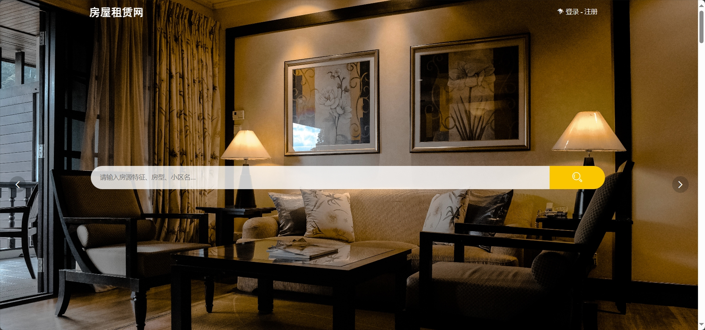
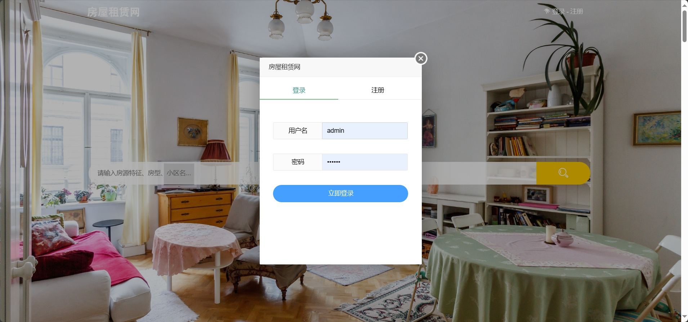
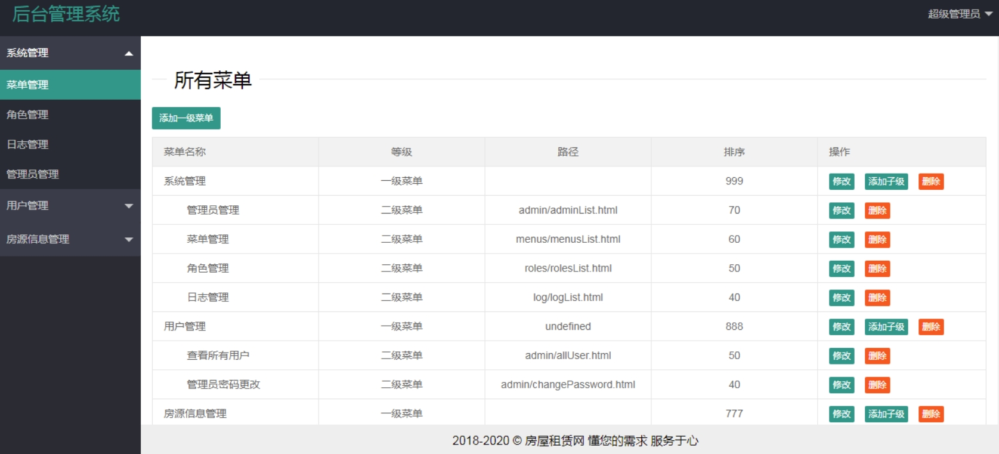
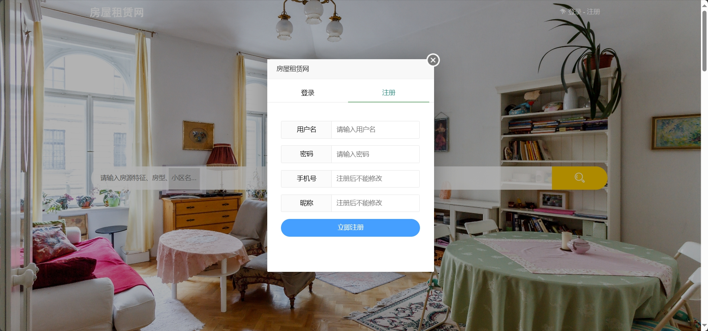
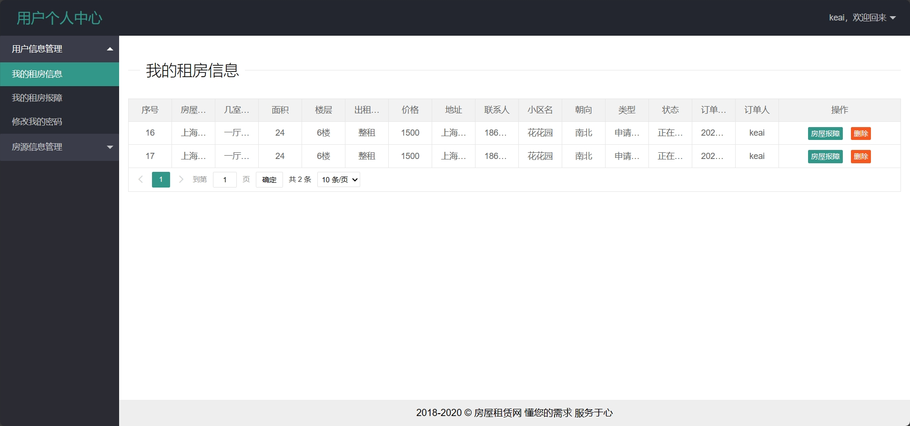

<h1 align="center">基于SSM框架的房屋租赁系统</h1>

 获取sql文件 QQ: 605739993 QQ群: 377586148 

 [个人站点: 从戎源码网](https://armycodes.com/)

## 简介

> 本代码来源于网络,仅供学习参考使用!
>
> 提供1.远程部署/2.修改代码/3.设计文档指导/4.框架代码讲解等服务
>
> 管理端地址：http://localhost:8080/admin/index.html
>
> 管理员: admin 密码: 123456
>
> 用户端地址：http://localhost:8080/index.html
>
> 用户：zhangsan 密码: 123456
>

## 项目介绍

基于SSM框架的房屋租赁系统：前端 JSP、LayUI、JQuery、Ajax、Html，后端 maven、springmvc、mybatis；角色分为管理员和用户。管理员在后台管理房间，对用户信息进行管理、对维修订单进行管理等；用户按发布的房源进行租房、筛选房间信息、发布自己名下的房间等。主要功能如下：

### 启动方式

- 前端：
> 按钮启动 | 启动Tomcat

- 后端：
> 按钮启动 | 启动Tomcat

### 管理员：

- 基本操作：登录、修改密码、获取个人信息、日志管理
- 菜单管理：添加一级菜单、添加二级菜单、获取菜单列表、修改菜单信息、删除菜单
- 角色管理：获取角色列表、修改角色信息、删除角色、新增角色
- 管理员管理：获取管理员列表、新增管理员、修改管理员信息、删除管理员、重置管理员密码
- 用户管理：获取用户列表、查看用户详情、删除用户信息、修改用户信息
- 房源信息管理：获取房源列表、查看房源信息详情、修改房源信息、删除房源信息、添加房源信息
- 订单管理：获取订单列表、查看订单详情、修改订单状态、删除订单
- 房屋报障管理：获取报障列表、查看报障详情、修改报障维修状态

### 用户：

- 基本操作：登录、注册、修改密码、获取个人信息、修改个人信息
- 房源模块：获取房源列表、查看房源详情、申请看房、申请签合同、经纬定位、筛选房源信息
- 报障模块：房屋报障、删除报障、获取房屋报障列表、查看报障详情
- 房源模块：发布房源、获取发布房源列表、修改房源信息、删除房源、查看房源详情

## 环境

- <b>IntelliJ IDEA 2020.3</b>

- <b>Mysql 5.7.26</b>

- <b>Tomcat 9.0.41</b>

- <b>JDK 1.8</b>

## 运行截图

